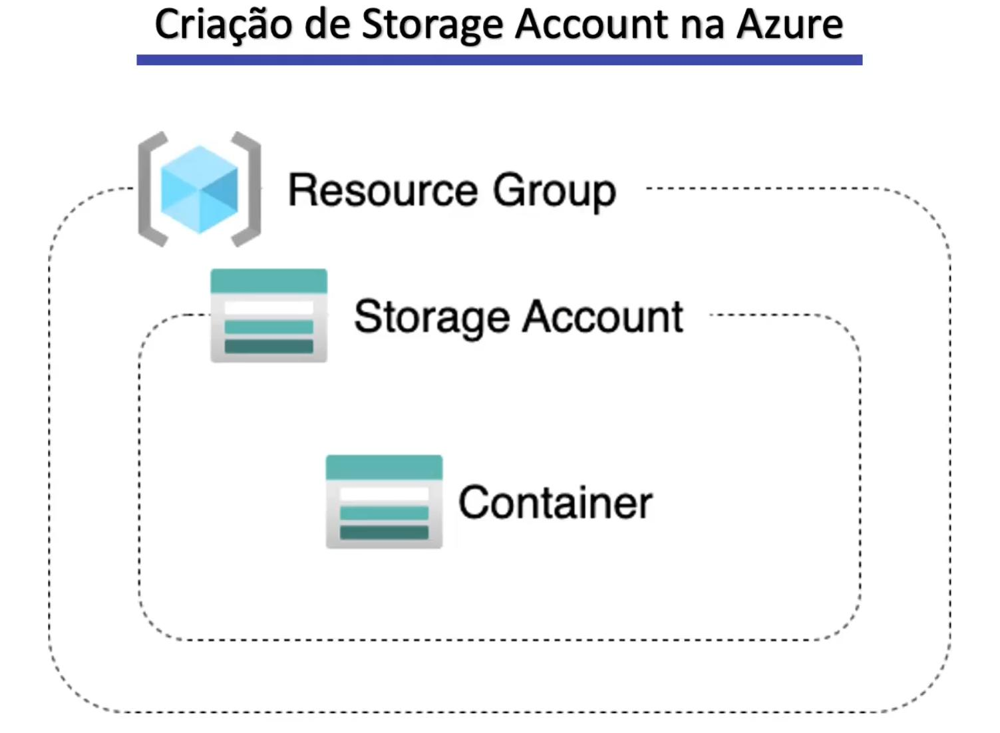

# Section-2 - Criação de Storage Account na Azure

Nesta seção estou estudando a criação de um **Storage Account** na **Azure Cloud**, que pode ser comparado a um **Bucket S3 na AWS**.  

O estudo segue o mesmo formato teórico e prático, porém ainda **não contém os comandos rodados** para provisionar ou destruir o recurso na Azure.  

---

## Conteúdos estudados

- Conceitos práticos de criação de um **Storage Account** na Azure.  
- Uso de **variables** para parametrizar valores no Terraform.  
- Uso de **locals** para definir valores reutilizáveis.  
- Uso de **output** para expor informações após a execução do plano.  

---

## Estrutura do recurso

A criação do Storage Account envolve os seguintes componentes:  
1. **Resource Group** – agrupador lógico de recursos na Azure.  
2. **Storage Account** – a conta de armazenamento em si.  
3. **Container** – onde os objetos/arquivos são armazenados dentro do Storage Account.  

---

## Como funciona

Abaixo está um diagrama ilustrativo do processo:  

  

---

> ⚠️ Este estudo está em andamento. A parte prática de provisionamento ainda será documentada futuramente.
